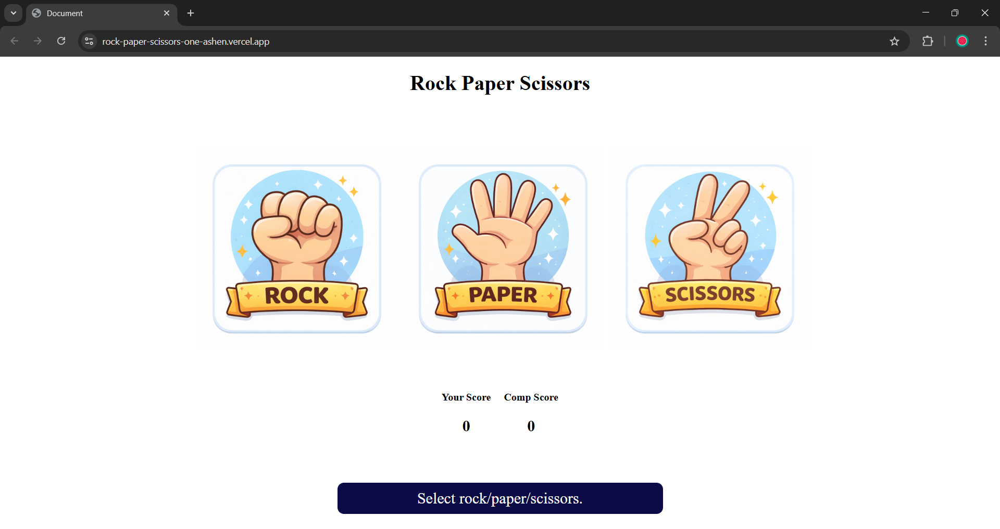

# 🪨📄✂️ Rock Paper Scissors Game

A fully interactive **Rock Paper Scissors** game built using **HTML, CSS, and JavaScript**. This project allows users to play the classic hand game against the computer, featuring a clean UI, real-time score tracking, and dynamic feedback.

## ✨ Features

* **Interactive Gameplay**: Click on Rock, Paper, or Scissors to make your move.
* **Smart Computer Logic**: The computer generates a random move instantly using JavaScript's `Math` module.
* **Real-time Scoreboard**: Tracks the score for both the User and the Computer.
* **Dynamic Status Updates**:
    * Displays who won the round (e.g., "You Win! Rock beats Scissors").
    * **Color-coded feedback**: The message bar turns **Green** when you win, **Red** when you lose, and a neutral color for a draw.
* **Hover Effects**: Visual cues when selecting your move.

## 🛠️ Technologies Used

* **HTML5**: Structure of the game board and choices.
* **CSS3**: Styling for the circular icons, scoreboard, and response messages.
* **JavaScript (ES6)**:
    * DOM Manipulation for updating scores and messages.
    * Event Listeners for handling user clicks.
    * Game logic for determining the winner.

## 🚀 How to Run

1.  Clone this repository:
    ```bash
    git clone [https://github.com/sumedhamandloi/Rock-paper-scissors-game.git](https://github.com/sumedhamandloi/Rock-paper-scissors-game.git)
    ```
2.  Navigate to the project folder.
3.  Open the `index.html` file in your browser.

## 📸 Screenshots



## 🧩 Code Snippet

A glimpse of the game logic:

```javascript
// Selection of computerChoice
let compSelection = () => {
    const arr = ["rock", "paper", "scissors"];
    const randIdx = Math.floor(Math.random() * 3);
    let output = arr[randIdx];
    return output;
};

// PlayGame
let playGame = (userChoice) => {
    const compChoice = compSelection();
    // Logic to determine winner and update UI
    let decision = decideWin(userChoice, compChoice);
    displayRes(decision, compChoice, userChoice);
};
